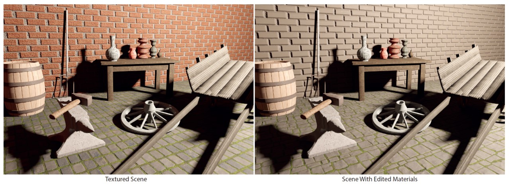

# An Inverse Procedural Modeling Pipeline for SVBRDF Maps
A semi-automatic framework for SVBRDF Proceduralization


Yiwei Hu, Cheng'an He, Valentin Deschaintre, Julie Dorsey, Holly Rushmeier
In ACM Transactions on Graphics (Presented at SIGGRAPH 2022). [[Project page]](https://yiweihu.netlify.app/project/hu2022/)
## Installation
The code was tested with Python 3.7 + Matlab 2021b on a Windows machine.
```
conda create -n SVBRDF_proceduralization python=3.7
conda activate SVBRDF_proceduralization
conda install pytorch torchvision cudatoolkit=11.3 -c pytorch
conda install -c numba numba
conda install -c anaconda scikit-image scikit-learn pyqt
conda install -c conda-forge gpyopt pyflann kornia visdom opencv matplotlib imageio-ffmpeg
```
Matlab and [Matlab Engine API](https://www.mathworks.com/help/matlab/matlab-engine-for-python.html) for Python should be installed properly.

Precomputed Features for PPTBF query can be found in https://drive.google.com/file/d/1lY5Jb_i99FSrfghT_BbgkDQe9iKs2ge_/view?usp=sharing. 
Please unzip `PPTBF_database.zip` and put all files into `PPTBF/database` folder.

*Note that Matlab 2022b doesn't support Python 3.7. We recommend using eariler version of Matlab Engine e.g Matlab 2021b.*

## Usage
#### Interface for material decomposition
We have a QT-based interface to decompose materials which requires user input, please call `start_app()` in `main.py` to start it. Several sample materials are provided under `samples`, feel free to load and decompose them with our interface.

For our interface, all operations can be done with a mouse, where:
- the left button is used for drawing strokes
- the right button is used for panning the image
- the scroll button is used for zooming in and out

We provide two material decomposition examples in our [supplemental video](https://youtu.be/BUppiilIrM8?t=28), please refer to them for operational details.

#### Proceduralization
See `main.py` for details. Please check instructions in functions `synthesize()`. 
Parameters are pre-defined in `config.py` as default values, but parameters can be tuned to produce best results. 
When running `synthesize()`, please make sure to start a visdom server for loss visualization (Line 34 in `main.py`).

As almost all computations are based on Python and Matlab for easy-to-use purpose, performance is sacrificed. 
Inverse PPTBF fitting and gabor approximation takes most time. To accelerate computation (may degrade quality), 
one could specify noises synthesis method for all material maps as `NoiseModelParamsConfig0` or disable gabor approximation

Intermediate results are all cached in `results` folder and final outputs are saved in `results/synthesis_results`. 
Results from each step are visualized for reference. Also, models can be fine-tuned by deleting cached intermediate results 
and restart proceduralization with a different configuration.

We also include pre-decomposed results of some samples to quickly test proceduralization. Unzip the `results.zip` to `results` folder 
to quickly start the test.

#### Resynthesis and super-resolution
In `main.py`, function `resynthesize()` shows a few examples about how to generate/synthesize the procedural model 
and resynthesize a higher-resolution SVBRDF using the output model. Corresponding results will be saved in `synthesis` and `superres` folder.
## Citation
```
@article{hu2022,
  title={An Inverse Procedural Modeling Pipeline for SVBRDF Maps},
  author={Hu, Yiwei and He, Chengan and Deschaintre, Valentin and Dorsey, Julie and Rushmeier, Holly},
  journal={ACM Transactions on Graphics (TOG)},
  volume={41},
  number={2},
  pages={1--17},
  year={2022},
  publisher={ACM New York, NY}
}
```

## Contact
If you have any question, feel free to contact yiwei.hu@yale.edu
